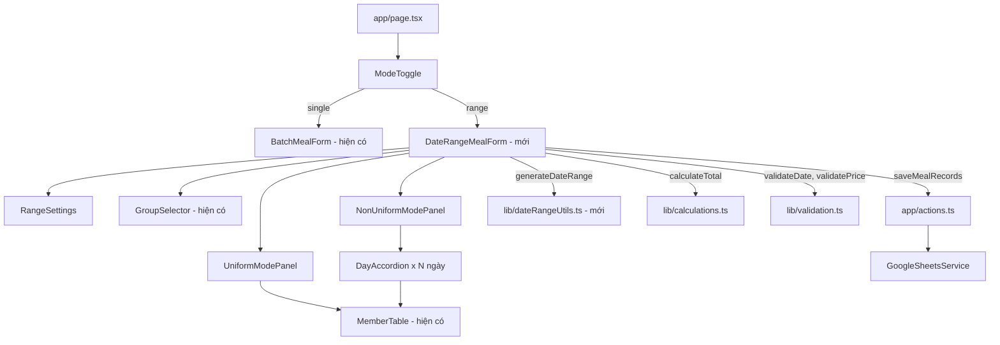

# Tài Liệu Thiết Kế: Chấm Cơm Theo Khoảng Ngày

## Tổng Quan

Tính năng này mở rộng ứng dụng "Chấm Cơm Cơ Quan" bằng cách thêm chế độ chấm cơm theo khoảng ngày. Người dùng có thể chuyển đổi giữa chế độ một ngày (hiện có) và khoảng ngày (mới). Ở chế độ khoảng ngày, người dùng chọn nhóm, nhập khoảng ngày, rồi chọn một trong hai chế độ con: **Đồng nhất** (một bảng chấm cơm áp dụng cho tất cả ngày) hoặc **Không đồng nhất** (mỗi ngày có bảng riêng với hệ số ngày lễ độc lập).

Thiết kế tái sử dụng tối đa các thành phần và logic hiện có: `MemberTable`, `calculateTotal`, `saveMealRecords`, `validateDate`, `validatePrice`, `GROUP_TEMPLATES`.

## Kiến Trúc



Luồng dữ liệu:
1. Người dùng chọn chế độ "Khoảng ngày" → `DateRangeMealForm` được hiển thị
2. Người dùng nhập khoảng ngày + chọn nhóm + chọn chế độ đồng nhất/không đồng nhất
3. Người dùng chấm cơm → state cập nhật, số bản ghi tính lại theo thời gian thực
4. Nhấn "Lưu tất cả" → validate → `generateDateRange` → tạo danh sách `MealFormData` → `saveMealRecords`

## Thành Phần Và Giao Diện

### `lib/dateRangeUtils.ts` (mới)

Hàm tiện ích thuần túy để tạo danh sách ngày từ khoảng ngày.

```typescript
/**
 * Tạo mảng các ngày liên tiếp từ startDate đến endDate (bao gồm cả hai đầu mút).
 * Trả về mảng rỗng nếu startDate > endDate.
 */
export function generateDateRange(startDate: string, endDate: string): string[]

/**
 * Tính số ngày trong khoảng [startDate, endDate].
 * Trả về 0 nếu startDate > endDate.
 */
export function countDaysInRange(startDate: string, endDate: string): number
```

### `components/ModeToggle.tsx` (mới)

Hiển thị hai nút chuyển đổi chế độ: "Một ngày" và "Khoảng ngày".

```typescript
interface ModeToggleProps {
  mode: 'single' | 'range';
  onChange: (mode: 'single' | 'range') => void;
}
```

### `components/DateRangeMealForm.tsx` (mới)

Component chính điều phối toàn bộ tính năng khoảng ngày. Quản lý state tổng thể.

```typescript
interface RangeSettings {
  startDate: string;       // YYYY-MM-DD
  endDate: string;         // YYYY-MM-DD
  breakfastPrice: number;
  lunchPrice: number;
  dinnerPrice: number;
}

interface MemberMeals {
  breakfast: boolean;
  lunch: boolean;
  dinner: boolean;
}

// State cho chế độ đồng nhất
type UniformMeals = Record<string, MemberMeals>; // key = tên thành viên

// State cho chế độ không đồng nhất
interface DayConfig {
  isHoliday: boolean;
  memberMeals: Record<string, MemberMeals>;
}
type NonUniformMeals = Record<string, DayConfig>; // key = YYYY-MM-DD

// State tổng thể
selectedGroup: GroupId | null
rangeSettings: RangeSettings
uniformMode: 'uniform' | 'non-uniform'
uniformMeals: UniformMeals
nonUniformMeals: NonUniformMeals
isSubmitting: boolean
message: { type: 'success' | 'error'; text: string } | null
errors: Record<string, string>
```

### `components/RangeSettings.tsx` (mới)

Khu vực nhập khoảng ngày và giá bữa ăn.

```typescript
interface RangeSettingsProps {
  settings: RangeSettings;
  errors: Record<string, string>;
  onChange: (settings: RangeSettings) => void;
}
```

### `components/UniformModePanel.tsx` (mới)

Hiển thị một bảng `MemberTable` duy nhất cho chế độ đồng nhất.

```typescript
interface UniformModePanelProps {
  members: string[];
  memberMeals: UniformMeals;
  settings: { breakfastPrice: number; lunchPrice: number; dinnerPrice: number; isHoliday: false };
  onMealChange: (member: string, meal: 'breakfast' | 'lunch' | 'dinner', value: boolean) => void;
  onBulkChange: (meal: 'breakfast' | 'lunch' | 'dinner', value: boolean) => void;
}
```

### `components/NonUniformModePanel.tsx` (mới)

Hiển thị danh sách ngày dạng accordion, mỗi ngày có bảng `MemberTable` riêng.

```typescript
interface NonUniformModePanelProps {
  dates: string[];          // mảng YYYY-MM-DD từ generateDateRange
  members: string[];
  nonUniformMeals: NonUniformMeals;
  prices: { breakfastPrice: number; lunchPrice: number; dinnerPrice: number };
  onDayHolidayChange: (date: string, isHoliday: boolean) => void;
  onMealChange: (date: string, member: string, meal: 'breakfast' | 'lunch' | 'dinner', value: boolean) => void;
  onBulkChange: (date: string, meal: 'breakfast' | 'lunch' | 'dinner', value: boolean) => void;
}
```

Mỗi ngày hiển thị dưới dạng một `DayAccordion` có thể mở/đóng, với tiêu đề là ngày (định dạng DD/MM/YYYY), checkbox "Ngày lễ", và bảng `MemberTable` bên trong.

### `components/RecordCountBadge.tsx` (mới)

Hiển thị số bản ghi sẽ được lưu.

```typescript
interface RecordCountBadgeProps {
  count: number;
}
// Hiển thị "Sẽ lưu X bản ghi" hoặc "Chưa có bữa ăn nào được chọn" khi count = 0
```

## Mô Hình Dữ Liệu

### Tính Số Bản Ghi

**Chế độ đồng nhất:**
```typescript
const membersWithMeals = members.filter(name =>
  uniformMeals[name]?.breakfast || uniformMeals[name]?.lunch || uniformMeals[name]?.dinner
);
const dates = generateDateRange(rangeSettings.startDate, rangeSettings.endDate);
const recordCount = membersWithMeals.length * dates.length;
```

**Chế độ không đồng nhất:**
```typescript
const recordCount = dates.reduce((total, date) => {
  const dayConfig = nonUniformMeals[date];
  if (!dayConfig) return total;
  const membersWithMeals = members.filter(name =>
    dayConfig.memberMeals[name]?.breakfast ||
    dayConfig.memberMeals[name]?.lunch ||
    dayConfig.memberMeals[name]?.dinner
  );
  return total + membersWithMeals.length;
}, 0);
```

### Tạo Danh Sách `MealFormData` Trước Khi Lưu

**Chế độ đồng nhất:**
```typescript
const records: MealFormData[] = [];
for (const date of dates) {
  for (const name of membersWithMeals) {
    records.push({
      date,
      employeeName: name,
      breakfast: uniformMeals[name].breakfast,
      lunch: uniformMeals[name].lunch,
      dinner: uniformMeals[name].dinner,
      breakfastPrice: rangeSettings.breakfastPrice,
      lunchPrice: rangeSettings.lunchPrice,
      dinnerPrice: rangeSettings.dinnerPrice,
      isHoliday: false,
    });
  }
}
```

**Chế độ không đồng nhất:**
```typescript
const records: MealFormData[] = [];
for (const date of dates) {
  const dayConfig = nonUniformMeals[date] ?? { isHoliday: false, memberMeals: {} };
  for (const name of members) {
    const meals = dayConfig.memberMeals[name];
    if (!meals?.breakfast && !meals?.lunch && !meals?.dinner) continue;
    records.push({
      date,
      employeeName: name,
      breakfast: meals.breakfast,
      lunch: meals.lunch,
      dinner: meals.dinner,
      breakfastPrice: rangeSettings.breakfastPrice,
      lunchPrice: rangeSettings.lunchPrice,
      dinnerPrice: rangeSettings.dinnerPrice,
      isHoliday: dayConfig.isHoliday,
    });
  }
}
```

### Tích Hợp Vào `app/page.tsx`

`page.tsx` sẽ quản lý state `mode` và render `BatchMealForm` hoặc `DateRangeMealForm` tương ứng, với `ModeToggle` ở trên cùng.

```tsx
// app/page.tsx
'use client';
import { useState } from 'react';
import ModeToggle from '@/components/ModeToggle';
import BatchMealForm from '@/components/BatchMealForm';
import DateRangeMealForm from '@/components/DateRangeMealForm';

export default function Home() {
  const [mode, setMode] = useState<'single' | 'range'>('single');
  return (
    <main className="min-h-screen p-4 sm:p-6 md:p-8 bg-gradient-to-br from-blue-50 to-gray-50">
      <div className="max-w-3xl mx-auto space-y-6">
        <h1 className="text-2xl sm:text-3xl font-bold text-center text-gray-800">
          Chấm Cơm Cơ Quan
        </h1>
        <ModeToggle mode={mode} onChange={setMode} />
        {mode === 'single' ? <BatchMealForm /> : <DateRangeMealForm />}
      </div>
    </main>
  );
}
```

## Thuộc Tính Đúng Đắn (Correctness Properties)

*Một thuộc tính là đặc điểm hoặc hành vi phải đúng trong mọi lần thực thi hợp lệ của hệ thống — về cơ bản là một phát biểu hình thức về những gì hệ thống phải làm. Các thuộc tính đóng vai trò cầu nối giữa đặc tả dạng văn bản và các đảm bảo đúng đắn có thể kiểm chứng tự động.*

---

**Thuộc Tính 1: generateDateRange trả về mảng ngày liên tiếp đúng thứ tự**
*Với mọi* cặp ngày hợp lệ (startDate ≤ endDate), hàm `generateDateRange` phải trả về mảng các chuỗi ngày YYYY-MM-DD liên tiếp, bao gồm cả startDate và endDate, được sắp xếp theo thứ tự tăng dần, với độ dài bằng số ngày trong khoảng (bao gồm cả hai đầu mút).
**Validates: Requirements 8.1, 8.3, 8.4, 7.1**

---

**Thuộc Tính 2: generateDateRange — edge cases**
*Với* startDate = endDate, `generateDateRange` phải trả về mảng đúng một phần tử. *Với* startDate > endDate, `generateDateRange` phải trả về mảng rỗng.
**Validates: Requirements 8.2, 8.5**

---

**Thuộc Tính 3: Số bản ghi đồng nhất = thành viên có bữa ăn × số ngày**
*Với mọi* khoảng ngày hợp lệ và mọi trạng thái `uniformMeals`, số bản ghi được tạo khi lưu ở chế độ đồng nhất phải bằng đúng (số thành viên có ít nhất một bữa ăn) × (số ngày trong khoảng).
**Validates: Requirements 4.4, 4.5, 7.2**

---

**Thuộc Tính 4: Số bản ghi không đồng nhất = tổng cặp (thành viên có bữa ăn, ngày)**
*Với mọi* khoảng ngày hợp lệ và mọi cấu hình `nonUniformMeals`, số bản ghi được tạo khi lưu ở chế độ không đồng nhất phải bằng tổng số cặp (thành viên có ít nhất một bữa ăn, ngày) trên tất cả các ngày.
**Validates: Requirements 5.5, 7.3**

---

**Thuộc Tính 5: Hệ số ngày lễ per-day trong chế độ không đồng nhất**
*Với mọi* cấu hình `nonUniformMeals`, mỗi bản ghi được tạo phải có `isHoliday` bằng đúng giá trị `isHoliday` của `DayConfig` tương ứng với ngày của bản ghi đó.
**Validates: Requirements 5.3, 5.6, 7.3**

---

**Thuộc Tính 6: Validation ngăn lưu khi dữ liệu không hợp lệ**
*Với mọi* tổ hợp đầu vào không hợp lệ (endDate < startDate, khoảng > 31 ngày, ngày không hợp lệ, giá không dương), hàm validate phải trả về lỗi tương ứng và `saveMealRecords` không được gọi.
**Validates: Requirements 2.5, 2.6, 2.7, 2.8**

---

**Thuộc Tính 7: Reset sau khi lưu thành công**
*Với mọi* trạng thái bữa ăn trước khi lưu, sau khi `saveMealRecords` trả về thành công, tất cả checkbox bữa ăn phải được đặt lại về `false`, trong khi khoảng ngày, giá và nhóm đã chọn phải giữ nguyên.
**Validates: Requirements 7.7**

---

**Thuộc Tính 8: Chuyển đổi chế độ đặt lại trạng thái**
*Với mọi* trạng thái nhập liệu bất kỳ, sau khi người dùng chuyển đổi chế độ (single ↔ range), toàn bộ trạng thái nhập liệu phải về giá trị mặc định.
**Validates: Requirements 1.5**

---

## Xử Lý Lỗi

**Lỗi validation khoảng ngày:**
- `endDate < startDate` → lỗi "Ngày kết thúc phải lớn hơn hoặc bằng ngày bắt đầu"
- Khoảng > 31 ngày → lỗi "Khoảng ngày tối đa là 31 ngày"
- Ngày không hợp lệ → lỗi "Vui lòng chọn ngày hợp lệ"
- Giá không dương → lỗi tương ứng cho từng trường giá

**Lỗi khi không có bữa ăn nào:**
- Hiển thị "Vui lòng chọn ít nhất một bữa ăn", không gọi `saveMealRecords`

**Lỗi từ Google Sheets API:**
- `saveMealRecords` thất bại → hiển thị "Lưu thất bại. Vui lòng thử lại."
- Không reset checkbox để người dùng có thể thử lại

## Chiến Lược Kiểm Thử

### Kiểm Thử Đơn Vị (Unit Tests)

Tập trung vào các trường hợp cụ thể và điều kiện biên:

- `generateDateRange('2024-01-01', '2024-01-01')` → `['2024-01-01']`
- `generateDateRange('2024-01-01', '2024-01-03')` → `['2024-01-01', '2024-01-02', '2024-01-03']`
- `generateDateRange('2024-01-03', '2024-01-01')` → `[]`
- Render `ModeToggle` với đúng hai lựa chọn
- Chế độ mặc định là "Một ngày"
- Thông báo lỗi khi endDate < startDate
- Thông báo lỗi khi khoảng > 31 ngày
- Hiển thị "Chưa có bữa ăn nào được chọn" khi count = 0

### Kiểm Thử Thuộc Tính (Property-Based Tests)

Sử dụng thư viện **fast-check** (đã có trong dự án). Mỗi property test chạy tối thiểu 100 lần với dữ liệu ngẫu nhiên.

Mỗi property test phải được gắn tag theo định dạng:
`// Feature: cham-com-theo-khoang-ngay, Property N: <mô tả>`

| Property | Mô tả test | Yêu cầu |
|----------|-----------|---------|
| P1 | Sinh ngẫu nhiên cặp ngày hợp lệ, kiểm tra mảng kết quả liên tiếp, đúng thứ tự, bao gồm cả hai đầu mút | 8.1, 8.3, 8.4, 7.1 |
| P2 | Edge cases: startDate = endDate → 1 phần tử; startDate > endDate → mảng rỗng | 8.2, 8.5 |
| P3 | Sinh ngẫu nhiên uniformMeals + khoảng ngày, kiểm tra số bản ghi = thành viên có bữa ăn × số ngày | 4.4, 4.5, 7.2 |
| P4 | Sinh ngẫu nhiên nonUniformMeals + khoảng ngày, kiểm tra số bản ghi = tổng cặp (thành viên, ngày) | 5.5, 7.3 |
| P5 | Sinh ngẫu nhiên nonUniformMeals với isHoliday ngẫu nhiên, kiểm tra isHoliday trong bản ghi khớp với DayConfig | 5.3, 5.6 |
| P6 | Sinh ngẫu nhiên đầu vào không hợp lệ, kiểm tra validate trả về lỗi và saveMealRecords không được gọi | 2.5, 2.6, 2.7, 2.8 |
| P7 | Sinh ngẫu nhiên trạng thái bữa ăn, sau save thành công kiểm tra meals = false, settings giữ nguyên | 7.7 |
| P8 | Sinh ngẫu nhiên trạng thái nhập liệu, sau chuyển chế độ kiểm tra state về mặc định | 1.5 |
