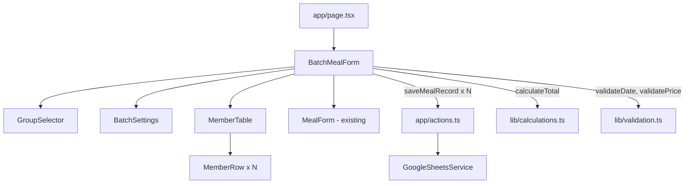

# Tài Liệu Thiết Kế: Chấm Cơm Theo Mẫu

## Tổng Quan

Tính năng này bổ sung một giao diện chấm cơm hàng loạt vào ứng dụng "Chấm Cơm Công Ty" hiện có. Người dùng chọn một nhóm mẫu (DQTT hoặc Cán bộ), sau đó đánh dấu bữa ăn cho tất cả thành viên trong một bảng duy nhất và lưu tất cả bản ghi chỉ với một lần nhấn nút. Nhóm "Người ngoài" vẫn dùng form cá nhân hiện có.

Thiết kế ưu tiên tái sử dụng tối đa logic hiện có (`calculateTotal`, `saveMealRecord`, `validateDate`, `validatePrice`) và chỉ thêm các thành phần UI mới cần thiết.

## Kiến Trúc



Luồng dữ liệu:
1. Người dùng chọn nhóm → `BatchMealForm` tải danh sách thành viên từ hằng số `GROUP_TEMPLATES`
2. Người dùng thay đổi cài đặt chung (`BatchSettings`) → state được cập nhật, tổng tiền từng hàng tính lại
3. Người dùng tích checkbox → state `memberMeals` cập nhật, tổng tiền hàng đó tính lại
4. Nhấn "Lưu tất cả" → validate → gọi `saveMealRecord` tuần tự cho từng thành viên có bữa ăn

## Thành Phần Và Giao Diện

### `lib/groupTemplates.ts` (mới)

Chứa dữ liệu tĩnh về các nhóm mẫu.

```typescript
export type GroupId = 'dqtt' | 'can-bo' | 'nguoi-ngoai';

export interface GroupTemplate {
  id: GroupId;
  label: string;
  members: string[]; // tên nhân viên
}

export const GROUP_TEMPLATES: GroupTemplate[] = [
  {
    id: 'dqtt',
    label: 'DQTT (Dân quân tự vệ)',
    members: [
      'Trần Long Hải',
      'Lê Kỳ Hoàng',
      'Lê Hà Hải Quân',
      'Nguyễn Thành Đô',
      'Nguyễn Lê Hiếu Thịnh',
      'Lê Nguyễn Đức Tâm',
    ],
  },
  {
    id: 'can-bo',
    label: 'Cán bộ',
    members: [
      'Võ Văn Linh',
      'Trần Cao Thi',
      'Nguyễn Thành Kính',
      'Đinh Kiều Anh Phụng',
    ],
  },
  { id: 'nguoi-ngoai', label: 'Người ngoài', members: [] },
];
```

### `components/BatchMealForm.tsx` (mới)

Component chính điều phối toàn bộ tính năng. Quản lý state tổng thể.

Props: không có (standalone component)

State:
```typescript
interface BatchSettings {
  date: string;           // YYYY-MM-DD
  breakfastPrice: number;
  lunchPrice: number;
  dinnerPrice: number;
  isHoliday: boolean;
}

interface MemberMeals {
  breakfast: boolean;
  lunch: boolean;
  dinner: boolean;
}

// state
selectedGroup: GroupId | null
settings: BatchSettings
memberMeals: Record<string, MemberMeals>  // key = tên nhân viên
isSubmitting: boolean
message: { type: 'success' | 'error'; text: string } | null
errors: Record<string, string>
```

### `components/GroupSelector.tsx` (mới)

Hiển thị 3 nút/tab để chọn nhóm.

```typescript
interface GroupSelectorProps {
  selectedGroup: GroupId | null;
  onSelect: (group: GroupId) => void;
}
```

### `components/MemberTable.tsx` (mới)

Hiển thị bảng chấm cơm với header bulk-action và các hàng thành viên.

```typescript
interface MemberTableProps {
  members: string[];
  memberMeals: Record<string, MemberMeals>;
  settings: BatchSettings;
  onMealChange: (member: string, meal: 'breakfast' | 'lunch' | 'dinner', value: boolean) => void;
  onBulkChange: (meal: 'breakfast' | 'lunch' | 'dinner', value: boolean) => void;
}
```

Header row chứa 3 checkbox "chọn tất cả" (một cho mỗi bữa). Trạng thái của mỗi checkbox header được tính từ `memberMeals`:
- Tất cả `true` → checked
- Tất cả `false` → unchecked
- Hỗn hợp → indeterminate (dùng `ref.indeterminate = true`)

### `components/MemberRow.tsx` (mới)

Một hàng trong bảng, hiển thị tên và 3 checkbox bữa ăn + tổng tiền.

```typescript
interface MemberRowProps {
  name: string;
  meals: MemberMeals;
  settings: BatchSettings;
  onChange: (meal: 'breakfast' | 'lunch' | 'dinner', value: boolean) => void;
}
```

Tổng tiền được tính inline bằng `calculateTotal`.

## Mô Hình Dữ Liệu

### State Trung Tâm Trong `BatchMealForm`

```typescript
// Cài đặt chung - chia sẻ cho tất cả thành viên
const [settings, setSettings] = useState<BatchSettings>({
  date: formatDateToYYYYMMDD(new Date().toISOString()),
  breakfastPrice: 12000,
  lunchPrice: 30000,
  dinnerPrice: 30000,
  isHoliday: false,
});

// Trạng thái bữa ăn của từng thành viên
const [memberMeals, setMemberMeals] = useState<Record<string, MemberMeals>>({});
```

Khi nhóm được chọn, `memberMeals` được khởi tạo với tất cả thành viên của nhóm, mỗi người có `{ breakfast: false, lunch: false, dinner: false }`.

### Luồng Lưu Dữ Liệu

```typescript
// Lọc thành viên có ít nhất 1 bữa ăn
const membersToSave = members.filter(name =>
  memberMeals[name].breakfast || memberMeals[name].lunch || memberMeals[name].dinner
);

// Gọi tuần tự
for (const name of membersToSave) {
  await saveMealRecord({
    date: settings.date,
    employeeName: name,
    ...memberMeals[name],
    breakfastPrice: settings.breakfastPrice,
    lunchPrice: settings.lunchPrice,
    dinnerPrice: settings.dinnerPrice,
    isHoliday: settings.isHoliday,
  });
}
```

### Tích Hợp Vào `app/page.tsx`

`page.tsx` sẽ render `BatchMealForm` thay thế hoặc bên cạnh `MealForm`. Vì `BatchMealForm` đã bao gồm tab "Người ngoài" hiển thị `MealForm`, `page.tsx` chỉ cần render `BatchMealForm`.

```tsx
// app/page.tsx
import BatchMealForm from '@/components/BatchMealForm';

export default function Home() {
  return (
    <main className="min-h-screen p-4 sm:p-6 md:p-8 bg-gradient-to-br from-blue-50 to-gray-50">
      <div className="max-w-3xl mx-auto">
        <h1 className="text-2xl sm:text-3xl font-bold text-center mb-6 text-gray-800">
          Chấm Cơm Công Ty
        </h1>
        <BatchMealForm />
      </div>
    </main>
  );
}
```


## Thuộc Tính Đúng Đắn (Correctness Properties)

*Một thuộc tính là đặc điểm hoặc hành vi phải đúng trong mọi lần thực thi hợp lệ của hệ thống — về cơ bản là một phát biểu hình thức về những gì hệ thống phải làm. Các thuộc tính đóng vai trò cầu nối giữa đặc tả dạng văn bản và các đảm bảo đúng đắn có thể kiểm chứng tự động.*

---

**Thuộc Tính 1: Thành viên nhóm khớp với mẫu**
*Với mọi* nhóm mẫu (GroupTemplate), khi người dùng chọn nhóm đó, danh sách thành viên hiển thị trong bảng phải bằng đúng danh sách `members` được định nghĩa trong `GROUP_TEMPLATES`.
**Validates: Requirements 1.2, 1.3, 3.2**

---

**Thuộc Tính 2: Trạng thái mặc định của checkbox bữa ăn**
*Với mọi* nhóm mẫu, khi nhóm được chọn lần đầu, tất cả checkbox bữa ăn (sáng, trưa, chiều) của tất cả thành viên phải ở trạng thái `false`.
**Validates: Requirements 3.3**

---

**Thuộc Tính 3: Tính đúng đắn của tổng tiền**
*Với mọi* thành viên, mọi tổ hợp bữa ăn được chọn, mọi bộ giá hợp lệ và mọi giá trị hệ số (1 hoặc 2), tổng tiền hiển thị trong hàng của thành viên đó phải bằng `calculateTotal(breakfast, lunch, dinner, breakfastPrice, lunchPrice, dinnerPrice, multiplier)`.
**Validates: Requirements 3.4, 3.5, 6.1**

---

**Thuộc Tính 4: Bulk toggle đặt/xóa tất cả thành viên**
*Với mọi* loại bữa ăn (sáng/trưa/chiều) và mọi nhóm, khi người dùng tích checkbox "chọn tất cả" cho bữa đó, tất cả thành viên phải có bữa đó là `true`; khi bỏ tích, tất cả thành viên phải có bữa đó là `false`.
**Validates: Requirements 4.2, 4.3, 4.4, 4.5, 4.6, 4.7**

---

**Thuộc Tính 5: Trạng thái checkbox header phản ánh tổng hợp**
*Với mọi* loại bữa ăn và mọi trạng thái `memberMeals`, checkbox header phải là `checked` khi tất cả thành viên có bữa đó là `true`, `unchecked` khi tất cả là `false`, và `indeterminate` khi có cả `true` lẫn `false`.
**Validates: Requirements 4.8, 4.9**

---

**Thuộc Tính 6: Lưu chỉ lọc thành viên có bữa ăn**
*Với mọi* nhóm và mọi trạng thái `memberMeals`, khi nhấn "Lưu tất cả", `saveMealRecord` chỉ được gọi cho các thành viên có ít nhất một trong ba bữa ăn là `true`. Thành viên không có bữa ăn nào không được gọi.
**Validates: Requirements 5.2, 5.3**

---

**Thuộc Tính 7: Dữ liệu lưu khớp với trạng thái thành viên**
*Với mọi* thành viên được lưu, dữ liệu `MealFormData` truyền vào `saveMealRecord` phải khớp chính xác với: `employeeName` = tên thành viên, `date/prices/isHoliday` = cài đặt chung hiện tại, `breakfast/lunch/dinner` = trạng thái checkbox của thành viên đó.
**Validates: Requirements 5.2, 6.2, 6.4**

---

**Thuộc Tính 8: Reset sau khi lưu thành công**
*Với mọi* nhóm và mọi trạng thái trước khi lưu, sau khi `saveMealRecord` trả về thành công cho tất cả thành viên, tất cả checkbox bữa ăn phải được đặt lại về `false`, trong khi `date`, `breakfastPrice`, `lunchPrice`, `dinnerPrice`, và `isHoliday` phải giữ nguyên giá trị.
**Validates: Requirements 5.8**

---

**Thuộc Tính 9: Validation ngăn lưu khi dữ liệu không hợp lệ**
*Với mọi* giá trị ngày không hợp lệ (không qua `validateDate`) hoặc giá không hợp lệ (không qua `validatePrice`), nhấn "Lưu tất cả" không được gọi `saveMealRecord` và phải hiển thị thông báo lỗi tương ứng.
**Validates: Requirements 2.6, 2.7, 6.3**

---

## Xử Lý Lỗi

**Lỗi validation cài đặt chung:**
- Ngày không hợp lệ → hiển thị lỗi dưới trường ngày, block save
- Giá không dương → hiển thị lỗi dưới trường giá tương ứng, block save

**Lỗi khi không có bữa ăn nào được chọn:**
- Hiển thị thông báo lỗi cấp form: "Vui lòng chọn ít nhất một bữa ăn"
- Không gọi bất kỳ `saveMealRecord` nào

**Lỗi từ Google Sheets API:**
- Nếu một hoặc nhiều lần gọi `saveMealRecord` thất bại, thu thập tất cả lỗi
- Hiển thị: "Lưu thất bại X/Y bản ghi. Vui lòng thử lại."
- Không reset checkbox để người dùng có thể thử lại

**Lỗi mạng / timeout:**
- `saveMealRecord` đã có retry logic (3 lần với exponential backoff) trong `GoogleSheetsService`
- `BatchMealForm` xử lý exception từ `saveMealRecord` như một lỗi thất bại

## Chiến Lược Kiểm Thử

### Kiểm Thử Đơn Vị (Unit Tests)

Tập trung vào các trường hợp cụ thể và điều kiện biên:

- Render `GroupSelector` với đúng 3 nhóm
- Chọn nhóm "Người ngoài" hiển thị `MealForm`
- Giá trị mặc định của `BatchSettings` (ngày hôm nay, giá mặc định)
- Trạng thái nút "Lưu tất cả" khi đang submit (disabled)
- Thông báo lỗi khi không có bữa ăn nào được chọn
- Thông báo thành công sau khi lưu

### Kiểm Thử Thuộc Tính (Property-Based Tests)

Sử dụng thư viện **fast-check** (đã có trong `node_modules`). Mỗi property test chạy tối thiểu 100 lần với dữ liệu ngẫu nhiên.

Mỗi property test phải được gắn tag theo định dạng:
`// Feature: cham-com-theo-mau, Property N: <mô tả>`

| Property | Mô tả test | Yêu cầu |
|----------|-----------|---------|
| P1 | Sinh ngẫu nhiên GroupId, kiểm tra members hiển thị = GROUP_TEMPLATES[id].members | 1.2, 1.3 |
| P2 | Sinh ngẫu nhiên GroupId, kiểm tra tất cả memberMeals = false | 3.3 |
| P3 | Sinh ngẫu nhiên meals + prices + isHoliday, kiểm tra total = calculateTotal(...) | 3.4, 3.5 |
| P4 | Sinh ngẫu nhiên meal type + group, bulk toggle on/off, kiểm tra tất cả members | 4.2-4.7 |
| P5 | Sinh ngẫu nhiên memberMeals, kiểm tra header checkbox state | 4.8, 4.9 |
| P6 | Sinh ngẫu nhiên memberMeals, mock saveMealRecord, kiểm tra chỉ members có meals được gọi | 5.2, 5.3 |
| P7 | Sinh ngẫu nhiên member + settings, kiểm tra MealFormData truyền vào saveMealRecord | 5.2, 6.4 |
| P8 | Sinh ngẫu nhiên group + meals, sau save thành công kiểm tra meals reset, settings giữ nguyên | 5.8 |
| P9 | Sinh ngẫu nhiên invalid date/price, kiểm tra saveMealRecord không được gọi | 2.6, 2.7 |
